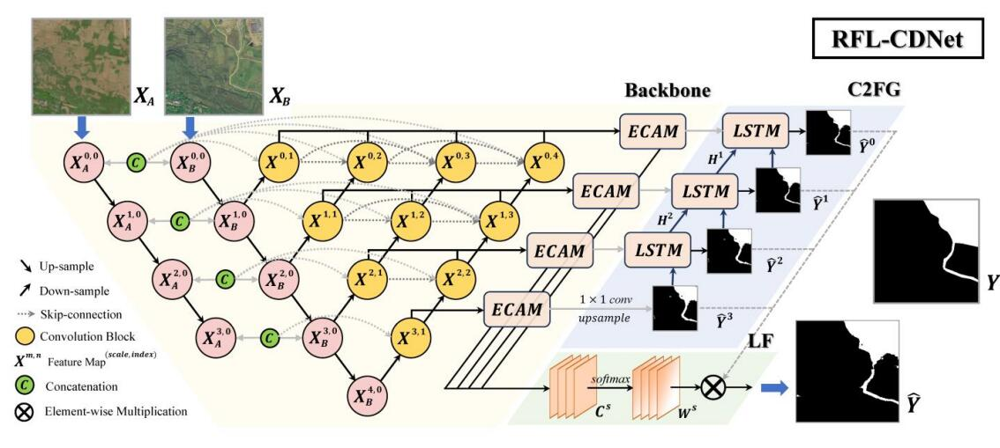
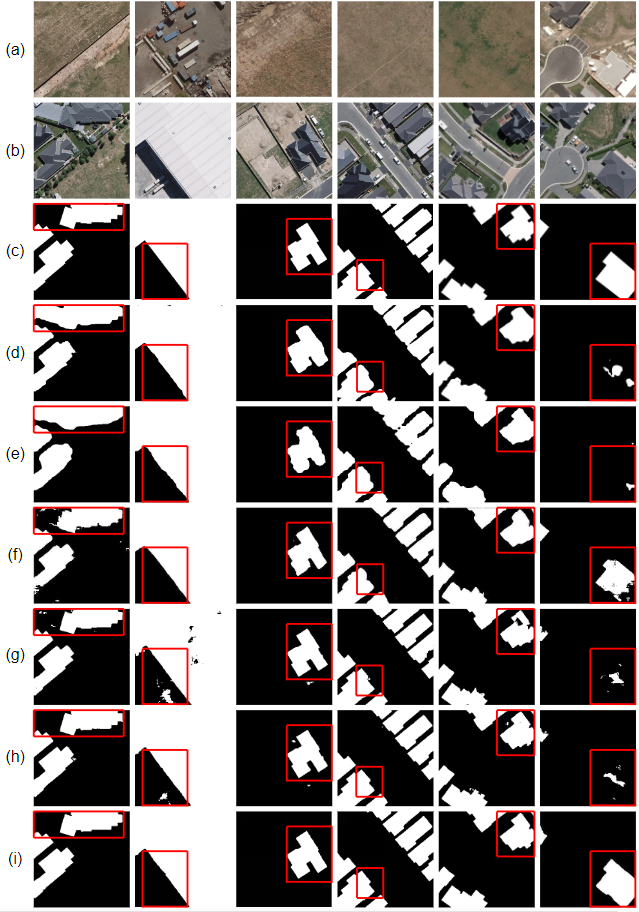

# **RFL-CDNet: Towards Accurate** Change Detection via Richer Feature Learning

This software implements RFL-CDNet: Towards Accurate Change Detection via Richer Feature Learning in PyTorch. For more details, please refer to our paper 

## Abstract

​    Change Detection is a crucial but extremely challenging task of remote sensing image analysis, and much progress has been made with the rapid development of deep learning. However, most existing deep learning-based change detection methods mainly focus on intricate feature extraction and multi-scale feature fusion, while ignoring the insufficient utilization of features in the intermediate stages, thus resulting in sub-optimal results. To this end, we propose a novel framework, named RFL-CDNet, to utilize richer feature learning for change detection. Specifically, we improve the capability and utilization of feature learning via introducing deep supervision information at the intermediate stages. Furthermore, we design the Coarse-To-Fine Guiding (C2FG) module and the Learnable Fusion (LF) module to further improve feature learning and learn more discriminative feature representations. The C2FG module aims to seamlessly integrate the side output from previous coarse-scale into the current fine-scale prediction in a coarse-to-fine manner, while LF module assumes that the contribution of each stage and each spatial location is independent, thus designing a learnable module to fuse multiple predictions. Experiments on several benchmark datasets show that our proposed RFL-CDNet achieves state-of-the-art performance.



## Installation

Install [PyTorch](http://pytorch.org/) 1.7.1+ and other dependencies:

```
pip/conda install pytorch>=1.7.1, tqdm, tensorboardX, opencv-python, pillow, numpy, sklearn
```

## Run demo

Generate the train.txt, val.txt and test.txt

```
python write_path.py
```

A demo program can be found in demo. Before running the demo, download our pretrained models and best models from [Baidu Netdisk](https://pan.baidu.com/s/1k_FPHtNttV2mBsJ-M0ukRw?pwd=emby ) (Extraction code: emby) . Then launch demo by:

```
python eval.py
```

## Evaluatioin

```
python eval.py
```

```
python visualization.py
```

## Train a new model

Generate the train.txt, val.txt and test.txt:

```
python write_path.py
```

Submit the train.sh:

```
sbatch train.sh
```

## Results

>  Here gives some examples of change detection results, comparing with existing methods on CDD Dataset in Figure (a), and Figure(b) is the results on WHU Dataset.  

|           (a)           |           (b)           |
| :---------------------: | :---------------------: |
|  |  |

Evaluation of RFL-CDNet on different datasets with SNUNet, STANet, and DASNet as baseline:

| Methods      | P(%)      | R(%)      | F1-score(%) |
| ------------ | --------- | --------- | ----------- |
| FC-EF        | 60.29     | 62.98     | 61.61       |
| FC-Siam-diff | 62.51     | 65.24     | 63.85       |
| FC-Siam-diff | 64.81     | 56.42     | 60.33       |
| STANet       | 62.75     | 69.47     | 65.94       |
| DASNet       | 60.58     | **77.00**     | 67.81       |
| SNUNet       | 68.88     | 72.09     | 70.45       |
| BIT          | **70.84**     | 70.11     | 70.48       |
| **Ours**     | 70.78 | 74.64 | **72.66**   |

​                                                            **Tabel 1. WHU Cultivated Land Dataset** 

| Methods      | P(%)      | R(%)      | F1-score(%) |
| ------------ | --------- | --------- | ----------- |
| FC-EF        | 80.75     | 67.29     | 73.40       |
| FC-Siam-diff | 54.20     | 81.34     | 65.05       |
| FC-Siam-diff | 48.84     | 88.96     | 63.06       |
| STANet       | 77.40     | 90.30     | 83.35       |
| DASNet       | 83,77     | **91.02**     | 87.24       |
| SNUNet       | 91.28     | 87.25     | 89.22       |
| BIT          | 86.64     | 81.48     | 83.98       |
| **Ours**     | **93.02** | 90.62 | **91.80**   |

​                                                                             **Tabel 2. WHU Dataset** 

| Methods      | P(%)      | R(%)      | F1-score(%) |
| ------------ | --------- | --------- | ----------- |
| FC-EF        | 84.68     | 65.13     | 73.63       |
| FC-Siam-diff | 88.81     | 62.20     | 73.16       |
| FC-Siam-diff | 87.57     | 66.69     | 75.72       |
| STANet       | 83.17     | 92.76     | 87.70       |
| DASNet       | 93.28     | 89.91     | 91.57       |
| SNUNet       | 92.40     | 90.13     | 91.25       |
| BIT          | 94.86     | 95.32     | 95.09       |
| **Ours**     | **96.32** | **96.46** | **96.39**   |

​																	**Tabel 3. CDD Dataset** 

## Acknowledgements

The authors would like to thank the developers of PyTorch, SNUNet, STANet, and DASNet. 
Please let me know if you encounter any issues.

